<p align="center">
  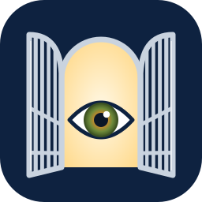
</p>

<h1 align="center">OpenVision</h1>

<p align="center">A free, open-source eye exam and eye-care records app for optometrists and ophthalmologists.</p>

OpenVision is a standalone electronic record for eye clinics: patients, visits, a full eye exam, glasses prescriptions, reports and a glaucoma flow sheet. It is built for small practices: fast enough for a busy clinic, light enough for an old office PC, and usable with a mouse, a keyboard or a tablet and pen. It runs as an offline Windows app (or in a browser on the same computer), speaks 6 languages (English, Spanish, French, Arabic, Chinese and Hindi), and is free and open source under the Apache-2.0 licence. Optional extras (AI drafting, imaging) are planned for practices that have the hardware.

Inspired by the well-regarded OpenEMR Eye Exam form (eye_mag), rebuilt from scratch with a modern, tablet-first design.

> **Pre-release (version 0.1).** Do not use OpenVision with real patient data until a practising eye-care professional has reviewed it. OpenVision does not encrypt its database yet; see [`docs/SECURITY.md`](docs/SECURITY.md).

## A quick tour

All names and clinical data in these screenshots are fictional (the built-in demo data plus a few made-up visits).

| | |
|---|---|
| 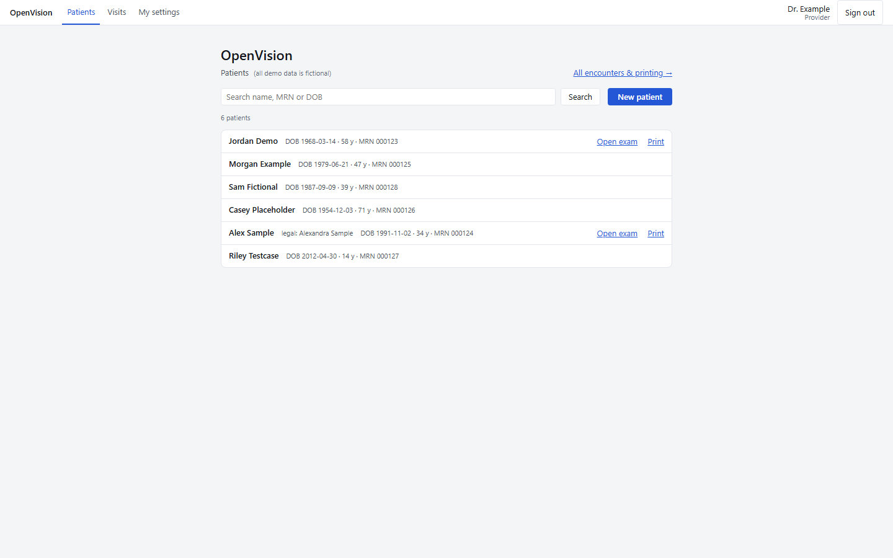 | 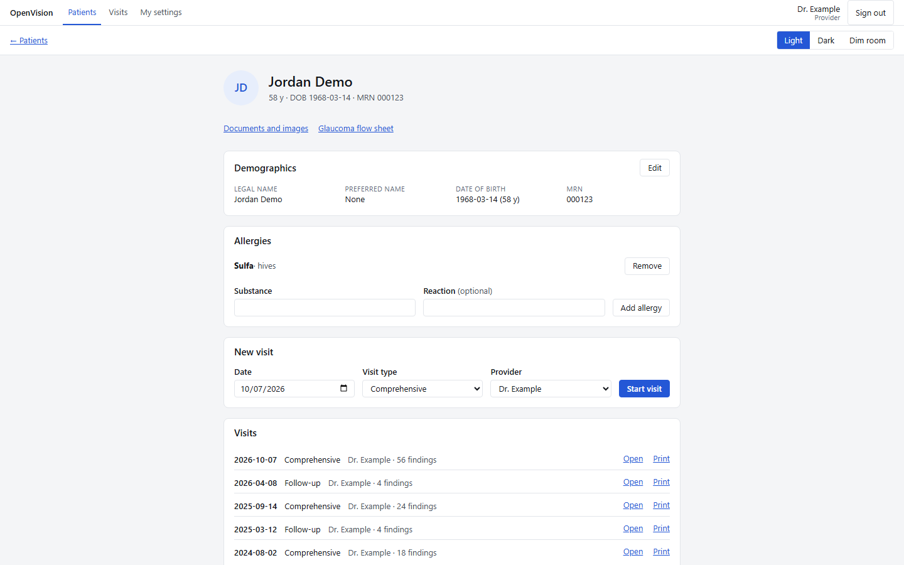 |
| **Patients.** Search by name, MRN or date of birth; open the exam or print in one click. | **Chart.** Demographics, allergies, a new visit in one row, and every past visit. |
| 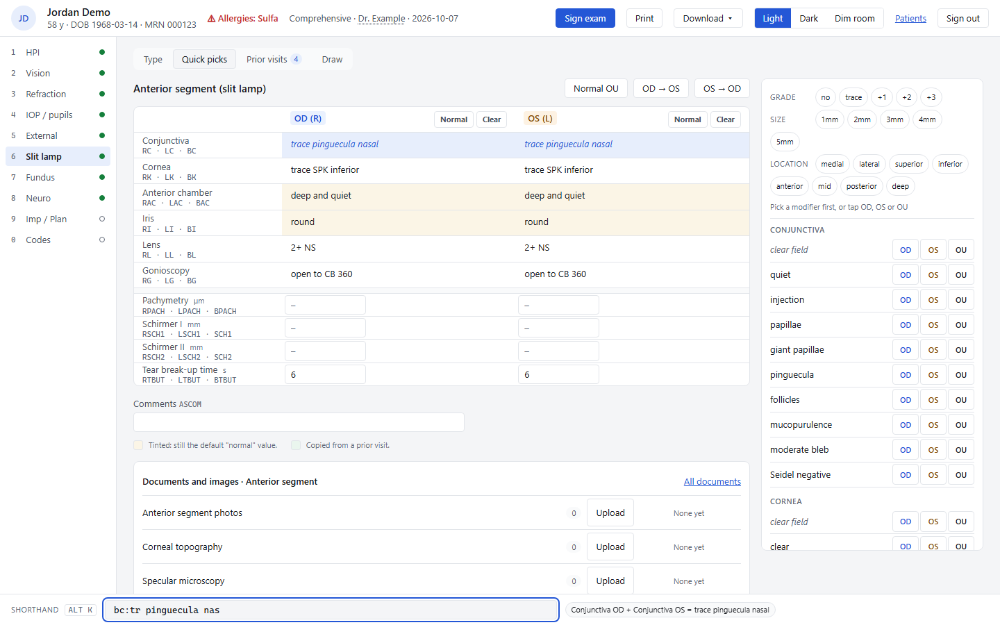 | 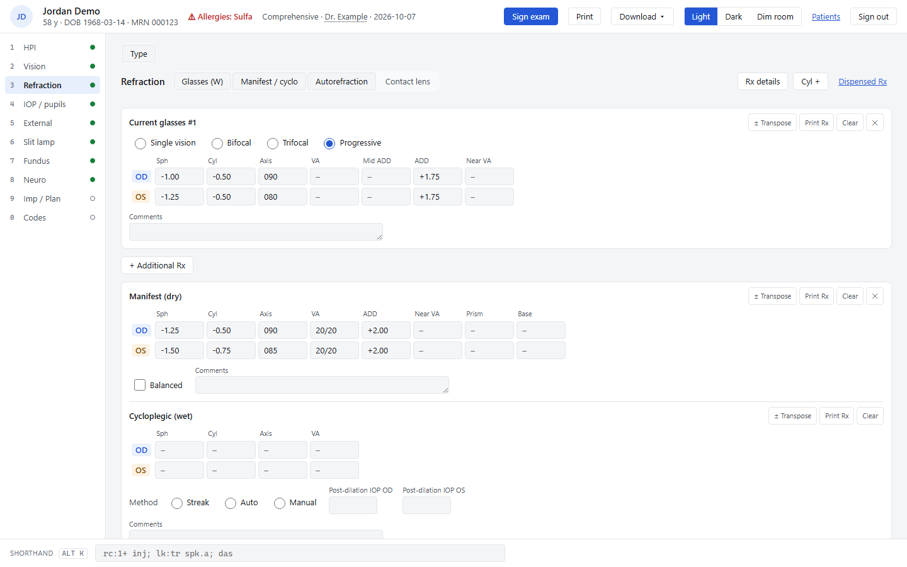 |
| **Slit lamp.** Shorthand bar at the bottom previews `bc:tr pinguecula nas` before you press Enter; quick picks on the right. | **Refraction.** Current glasses, manifest, cycloplegic, autorefraction and contact lenses, with transpose. |
| 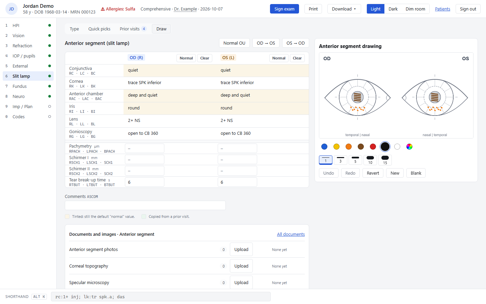 | 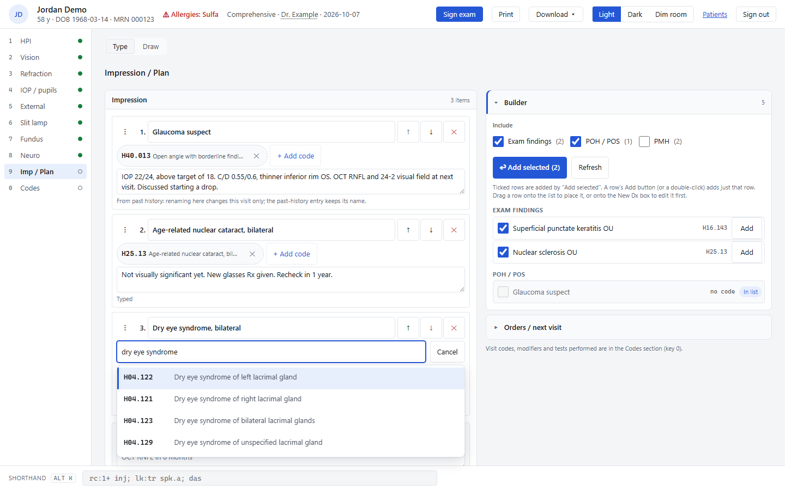 |
| **Drawings.** Draw on eye templates with a mouse, touch or pen; saved with the visit and printed on the report. | **Impression / plan.** The builder suggests items from findings and history; the code finder searches ICD-10-CM or ICD-11. |
| 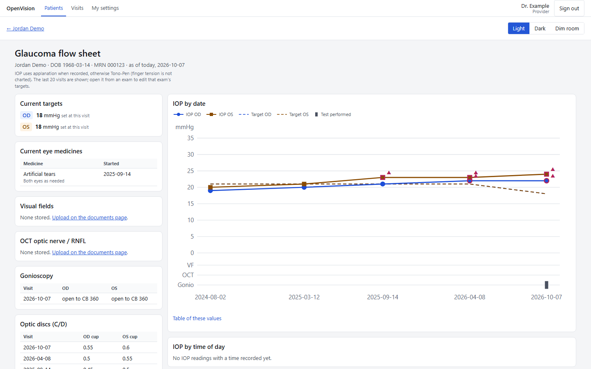 | 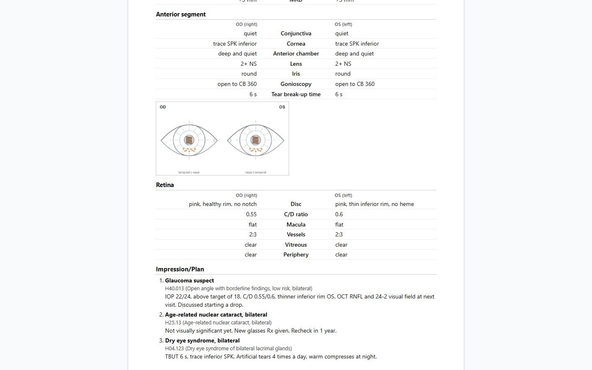 |
| **Glaucoma flow sheet.** IOP by date against the target, optic discs, gonioscopy and eye medicines. | **Report.** A printable exam report (or Save as PDF) with findings, drawings and the coded plan. |
| 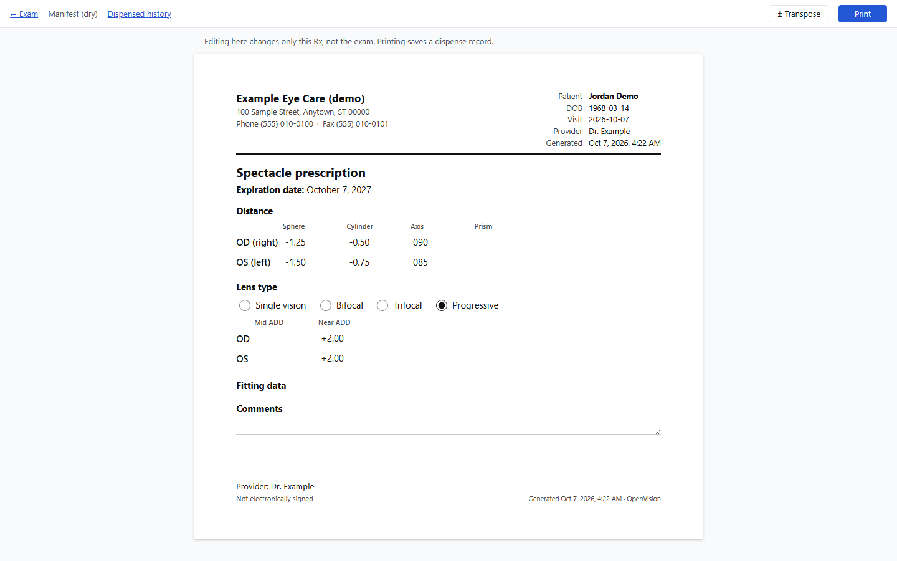 | 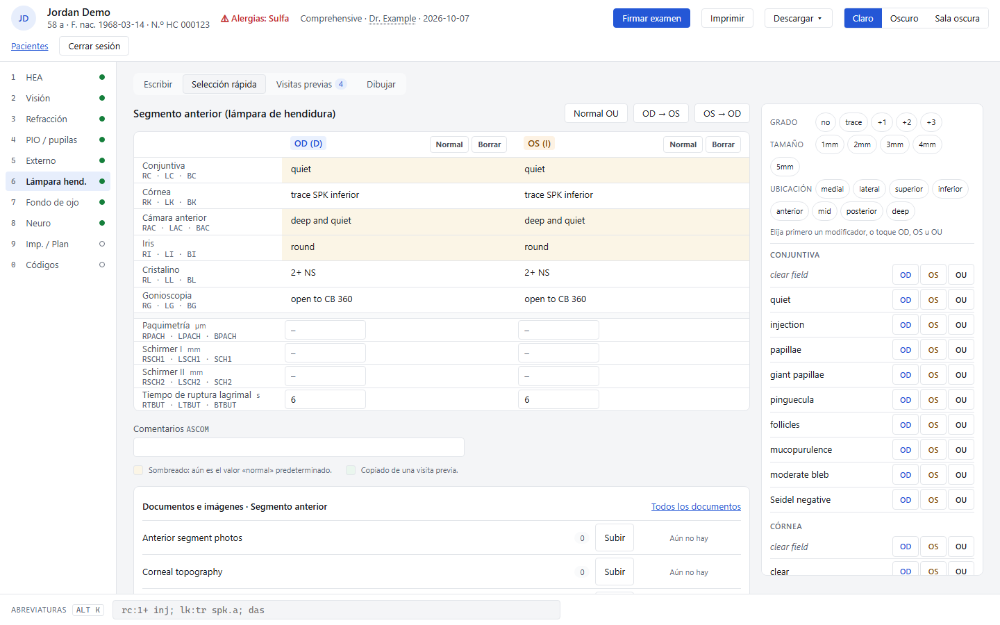 |
| **Glasses Rx.** A printable spectacle prescription; printing keeps a dispensed history. | **Spanish.** Every screen is translated; each user picks their own language. |
| 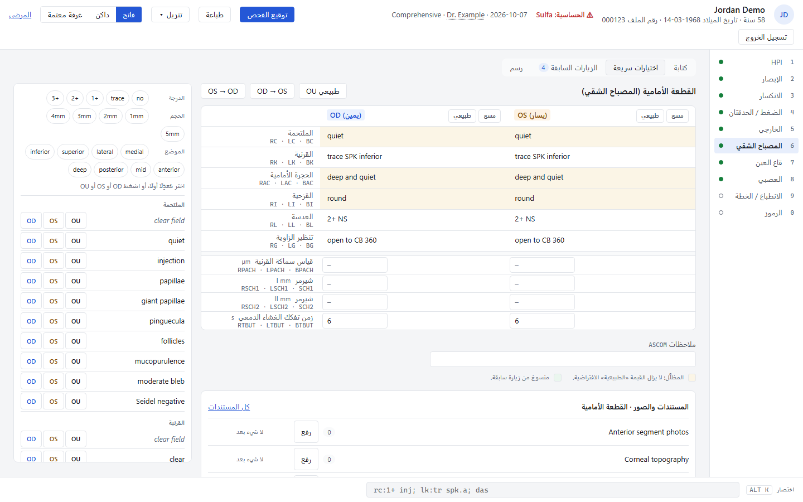 | 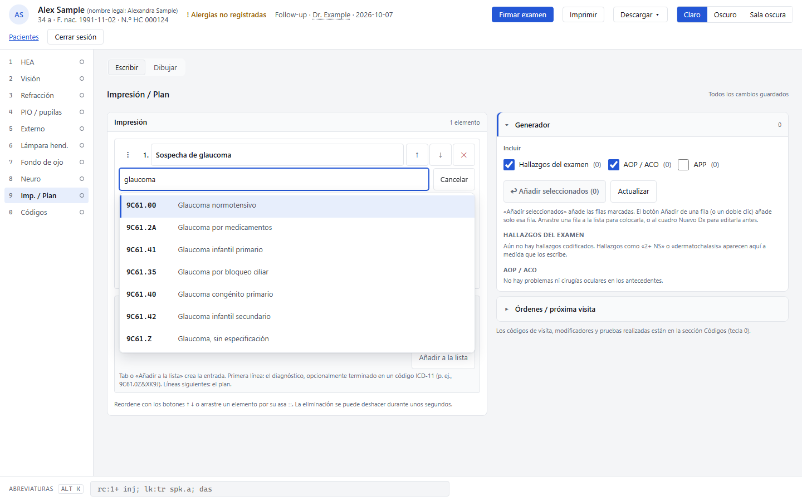 |
| **Arabic, right to left.** The layout mirrors, but OD stays on the viewer's left, as at the slit lamp. | **ICD-11 in your language.** The code finder shows WHO's official titles, here in Spanish. |
| 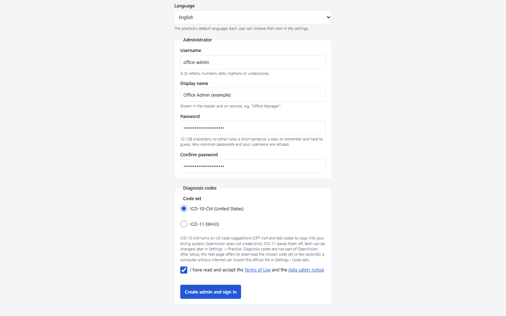 | 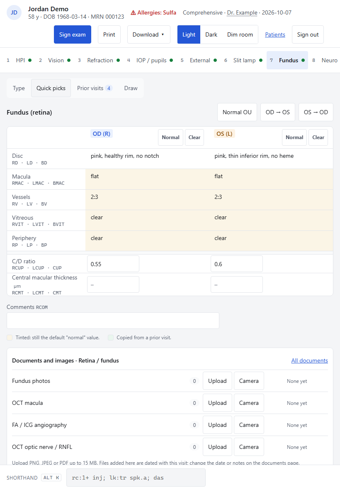 |
| **First run.** Create the admin account, pick the language and code set, and accept the terms. | **Tablet.** Portrait layout with large touch targets. |
| 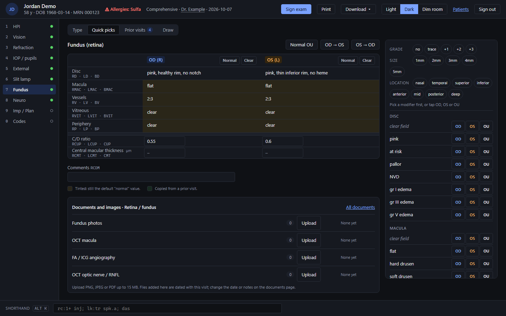 | 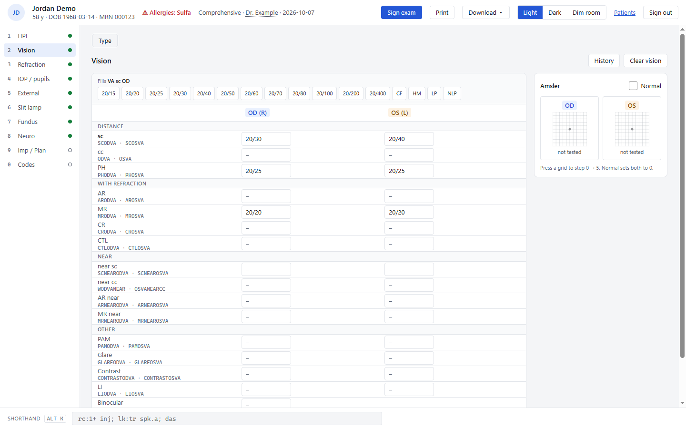 |
| **Dark and dim-room modes** for darkened exam rooms. | **Windows app.** The same app in its own window, working offline on the clinic PC. |

## What it does

Status: early (0.1.0). Still to come: database encryption at rest, see [`docs/SECURITY.md`](docs/SECURITY.md).

**Patients and history**
- Patients and visits: create, search, chart, new visit.
- Allergies are explicit: "not recorded", "no known allergies" (who confirmed and when) or a list.
- Past history: eye and medical problems, surgeries, eye and other medications, allergies, family and social history, with an editor, summary and shorthand (`poh:dry eye; all:penicillin rash`).
- Documents and images per patient and exam area, visual-acuity history, and a glaucoma flow sheet with IOP targets.

**The exam**
- HPI: three complaints, elements, chronic problems fed from history, Limited/Detailed hint; review of systems.
- Vision (acuity, Amsler); IOP, pupils and confrontation fields.
- Refraction: current glasses, manifest, cycloplegic, autorefraction, contact lens, transpose; printable spectacle and contact-lens Rx with dispensed history.
- External, slit lamp, fundus, and neuro (motility, alternate cover test with builder, color, stereo, NPC, amplitudes).
- Drawings: own canvas, touch and pen, versioned autosave, prior drawings.
- Fast entry: shorthand, normal defaults, copy between eyes, per-provider quick picks, prior visits with copy forward, undo, autosave.
- Light, dark and dim-room modes.

**Impression, plan and codes**
- Impression/plan builder from exam findings and history, with ICD-10-CM FY2027 or WHO ICD-11 code search (chosen per practice), orders and next visit.
- Code suggestions are a billing aid only; OpenVision never bills. It suggests eye-visit or office-visit codes with their reasons, modifiers, justifiers and tests performed; chosen codes print on the report for your billing system; US code suggestions can be switched off.

**Reports and sharing**
- Printable exam reports, one or many visits (Save as PDF).
- CSV and FHIR R4 export (with the impression/plan as Conditions).
- A Download menu in the exam (PDF or FHIR, to add the visit to another chart).

**Safety and administration**
- Exam locking while someone edits; final electronic signing with addenda.
- Sign-in with roles (admin, provider, technician), automatic logoff, and an audit log of sign-ins and chart views.
- Practice settings, users, per-user preferences and quick-pick editing.
- 6 languages, including right-to-left Arabic.
- A Windows desktop app (installer, automatic updates with a backup first).

## Install on Windows

Download `OpenVision-Setup-<version>.exe` from the project's GitHub Releases and run it as an administrator. Builds are not code-signed yet, so Windows SmartScreen warns ("Windows protected your PC": More info > Run anyway). The installer asks you to accept the data safety notice and the [Terms of Use](docs/TERMS.md) (see also the [Privacy Policy](docs/PRIVACY.md)), keeps the data in `C:\ProgramData\OpenVision`, and lets only the Windows group **OpenVision Users** open it; details, adding other Windows users, updates and uninstalling: [`desktop/README.md`](desktop/README.md). Turn on BitLocker: OpenVision does not encrypt its database yet.

Developers: `npm install`, `npm --prefix desktop install`, then `npm run desktop:dev` (opens the app in Electron, data in `data\desktop`) or `npm run desktop:dist` (builds `desktop\dist\OpenVision-Setup-<version>.exe`).

## Try it in a browser

Requires Node.js 24 or newer. Uses Node's built-in SQLite, so there is nothing native to compile.

```sh
npm install
npm run build
HOST=127.0.0.1 PORT=3000 BODY_SIZE_LIMIT=20M node build    # PowerShell: $env:HOST='127.0.0.1'; $env:PORT='3000'; $env:BODY_SIZE_LIMIT='20M'; node build
```

Open http://127.0.0.1:3000. A fresh install creates `data/openvision.sqlite` with two fictional patients and three demo accounts, all with the password `openvision-demo`: `demo-provider`, `demo-tech` and `demo-admin`. Set `OPENVISION_DB` to store the database elsewhere. Set `OPENVISION_DEMO=0` before the first start for an empty install; the first visit then asks you to create the admin account. Locked out? `node scripts/reset-admin.mjs <admin username>` on the server gives an admin a temporary password. Diagnosis codes are not part of the package: an admin downloads the practice's code set (ICD-10-CM or WHO ICD-11) in Settings > Code sets, or imports the official file on a computer without internet (see [`codes/README.md`](codes/README.md)).

> **Not for real patients yet.** Version 0.1.0 is a pre-release until a practising eye-care professional has reviewed it, and OpenVision does not encrypt its database. Keep the browser build bound to `127.0.0.1`, and read [`docs/SECURITY.md`](docs/SECURITY.md).

Development: `npm run codes:fetch` (once, downloads the diagnosis code sets into the git-ignored `codes/`), then `npm run dev`, `npm test`, `npm run check`.

In the exam: press `Alt+K` for the shorthand bar, then try `das; rc:1+ inj; lk:tr spk.a` and Enter. Keys `1`-`0` switch sections (`5` External, `6` Slit lamp, `7` Fundus). The **Quick picks** and **Prior visits** buttons open a helper panel; the demo patient Jordan Demo has two earlier visits to copy from. **Print** (or `Ctrl+P`) in the exam prints the report; **All encounters & printing** on the home page prints or exports many visits at once: **CSV** (one row per visit, for spreadsheets) or **FHIR R4** (a Bundle of Patient, Encounter, AllergyIntolerance and Observation resources, for other EHR systems).

## Docs

- How and why it was built: [`docs/PROJECT.md`](docs/PROJECT.md)
- Changes by version: [`CHANGELOG.md`](CHANGELOG.md)
- Design decisions: [`docs/DECISIONS.md`](docs/DECISIONS.md)
- [Terms of Use](docs/TERMS.md) and [Privacy Policy](docs/PRIVACY.md)
- Security and what the clinic is responsible for: [`docs/SECURITY.md`](docs/SECURITY.md)
- Windows desktop app: [`desktop/README.md`](desktop/README.md)
- Design direction: [`docs/design/DESIGN.md`](docs/design/DESIGN.md)
- Design tokens: [`src/lib/styles/tokens.css`](src/lib/styles/tokens.css)
- Clickable exam-screen preview: open [`docs/design/preview.html`](docs/design/preview.html) in a browser (all data fictional)

License: [Apache-2.0](LICENSE). This is a clean-room project: OpenEMR eye_mag (GPL-3) is used only as a feature reference. See [`docs/DECISIONS.md`](docs/DECISIONS.md) and [`CONTRIBUTING.md`](CONTRIBUTING.md).
